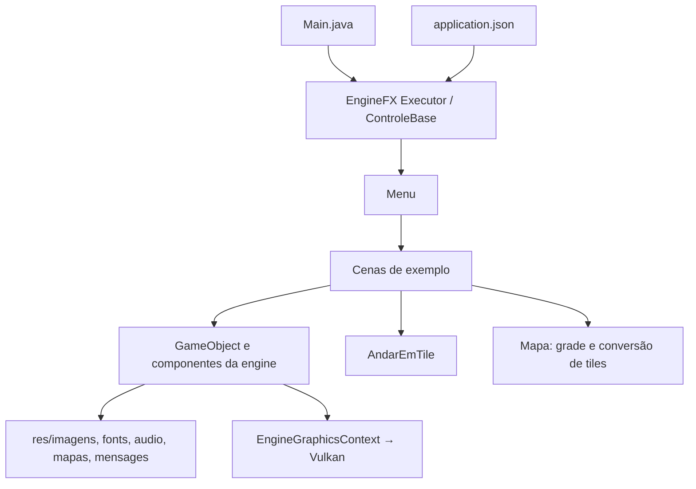

# BluePrint — dinofx

Atualizado em 10/09/2026. Este documento descreve a implementação; [PRD.md](PRD.md) acompanha trabalho futuro.

## Arquitetura

Aplicação Java 25/Maven baseada em cenas e composição de componentes. Depende de `enginefx:enginefx:2.0.0`; não implementa um renderer próprio. A engine fornece GLFW/Vulkan, input, tempo, recursos, áudio, texto, colisão e lifecycle.

Não há servidor, banco de dados, rede, framework de injeção ou camada de persistência. O fluxo é controlado pela engine. As fronteiras de gameplay são classes de cena e scripts reutilizáveis.

## Estrutura e build

| Caminho | Conteúdo |
| --- | --- |
| [pom.xml](pom.xml) | Dependência da engine, JUnit e empacotamento shaded |
| [Main.java](src/main/java/br/com/game/Main.java) | Delegação de startup à engine |
| `src/main/java/br/com/game/niveis/examples/` | Cenas e componente de grade Mapa |
| `src/main/java/br/com/game/script/` | Movimento reutilizável |
| `src/main/resources/` | Configuração e assets originais |
| `src/test/java/` | Testes unitários e harness Vulkan |
| [build.ps1](build.ps1) | Instala a engine irmã, empacota e opcionalmente executa smoke |

O shade produz `target/dino.jar`, com classe principal `br.com.game.Main`, manifesto Multi-Release e merge de `META-INF/services` para Nashorn. Assets entram em `res/` dentro do JAR. Descritores de módulo duplicados são excluídos porque a distribuição roda no classpath.

O script usa POMs absolutos derivados de `PSScriptRoot`, sem presumir CWD ou JDK específico. Maven vem do wrapper com distribuição/versionamento e checksum fixados.

## Registro e navegação

`application.json` fornece tamanho lógico, debug e a lista ordenada de cenas. Cada definição tem classe/recurso, tipo, título opcional e inclusão no menu. `Menu` é `@Bootable`.

O menu gera as entradas visíveis e guarda os índices originais das definições. Assim, ocultar uma cena não direciona Enter para outra. Configurações antigas sem `menu` continuam visíveis. Navegação usa repetição temporizada e limites antes da seleção.

Trocas são diferidas por `ControleBase.nextScene`. A engine descarta a visita anterior e instancia outra; câmera e relógio são reiniciados.

## Cenas

| Cena | Responsabilidade / observações |
| --- | --- |
| Menu | Título, entradas geradas, destaque de seleção e áudio ambiente |
| Spaceship | Movimento por delta, inimigos, tiros, explosões e callbacks de colisão |
| QuedaLivre | Demonstra gravidade e plataformas com integração/resposta próprias em update variável |
| Level001 | Fila de comandos e deslocamento na grade, a 60 pixels/s |
| Level002 | Mapa TMX, movimentação em tiles a 600 pixels/s e câmera |
| TiledMapGame | Visualização do TMX e navegação da câmera |
| Mapa | Conversão entre coordenadas da grade e posição de objetos |

`AndarEmTile` copia alvo e velocidade, avança cada eixo por `speed * deltaSeconds` no passo fixo e limita o deslocamento para chegar exatamente ao alvo. Aceita movimento em ambos os sinais, sem alterar os vetores fornecidos pelo chamador.

A física da engine é discreta e baseada em AABB. `QuedaLivre` ainda mantém uma política própria: não se deve concluir que todos os exemplos têm um modelo físico unificado apenas porque o movimento de tiles foi migrado.

## Assets e entrada

Todos os usos ativos migraram para caminhos como `imagens/nave.png`, `audio/rainy_city.wav`, `fonts/font.ttf` e `mapas/ola_mapa.tmx`. Referências de imagem dentro do TMX são relativas ao mapa. A engine permite overlay local pelo mesmo caminho antes de recorrer ao JAR.

Input de teclado é consultado via `KeyBoard`. O listener de mouse de Level002 pertence à cena e é liberado no descarte. Recursos gráficos são compartilhados pela engine; cada componente de áudio é dono de sua linha.

O tamanho lógico é 680 × 650 na configuração atual. Resize altera a superfície física; a engine mantém a projeção e a conversão do mouse nas coordenadas lógicas.

## Testes e limites

- `AndarEmTileTest`: movimento positivo/negativo a 30/60/144 chamadas por segundo, chegada sem ultrapassar o alvo, cópia de alvo e velocidade inválida.
- `MenuTest`: mapeamento com cenas ocultas e metadados ausentes.
- `GameMigrationSmokeApp`: inicializa GLFW/Vulkan, testa Nashorn e cache do JAR, cresce um buffer GPU, visita cenas repetidamente e força resize.
- O harness valida intervalos inclusivos de cenas; intervalo vazio/invertido é erro, não sucesso.

O smoke usa 120 frames por cena em duas passagens e não simula gameplay completo nem compara pixels. A validação local é registrada em [REVIEW.md](REVIEW.md), com limites de driver/superfície.

## Como evoluir

Uma nova cena deve chamar `super.setup()`, compor objetos, cadastrar metadados no JSON e fornecer assets. Uma nova regra reutilizável entra como componente/script; alterações de renderer ou resolução de recursos pertencem à engine.

Ao mudar física, acrescente teste de deslocamento/colisão; ao mudar empacotamento, execute o JAR fora do checkout. Preserve a ordem de transparência e evite expor objetos Vulkan ao jogo. Atualize este blueprint e o PRD quando a arquitetura ou os critérios de aceite mudarem.
