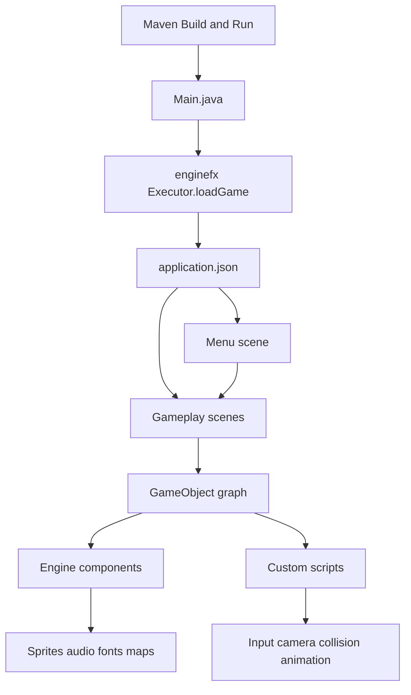
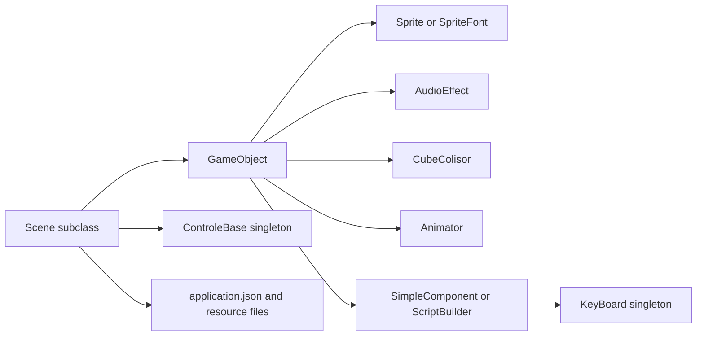
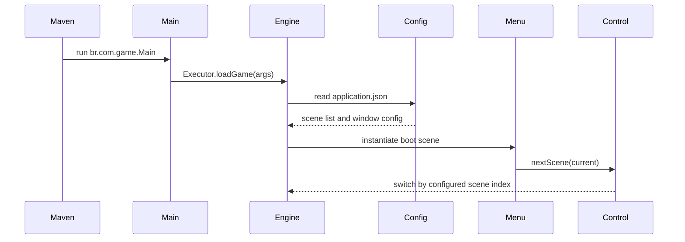

# Project Architecture Blueprint

Generated: 2026-06-02. Updated: 2026-06-03.

## 1. Architecture Detection And Analysis

### Technology Stack

- Java 25 application built with Maven
- Desktop runtime delegated to `enginefx` (LWJGL Vulkan + GLFW backend)
- External game engine dependency: `enginefx:enginefx:1.0.0`
- Fat-jar packaging through `maven-shade-plugin` (produces `target/dino.jar`)
- Resource-driven runtime configuration through `src/main/resources/application.json`

Primary build configuration lives in [pom.xml](pom.xml).

### Detected Architectural Pattern

This codebase is best described as a small monolithic game application with an engine-driven scene/component architecture.

It is not layered in the usual enterprise Java sense. Instead, the project delegates infrastructure, rendering, input dispatch, animation, and scene lifecycle to `enginefx`, while repository code mainly provides:

- scene definitions
- custom gameplay scripts
- resource declarations
- lightweight map and HUD components

## 2. Architectural Overview

The runtime starts in [src/main/java/br/com/game/Main.java](src/main/java/br/com/game/Main.java), but startup behavior is effectively controlled by [src/main/resources/application.json](src/main/resources/application.json). `Main` delegates immediately to the engine bootstrap, and the engine then loads configured scenes and resources.

The dominant design principle is composition over inheritance at gameplay level:

- scenes extend the engine `Scene` type
- game entities are `GameObject` instances
- behavior is attached by adding components and scripts to `GameObject`

Architectural boundaries are soft rather than enforced by interfaces. In practice, the key boundaries are:

- engine boundary: repository code depends heavily on `br.com.engine.*`
- scene boundary: each playable/demo experience is implemented as a scene class
- resource boundary: sprites, audio, fonts, and TMX maps are loaded by name from `src/main/resources`
- script boundary: reusable custom behavior is placed under `src/main/java/br/com/game/script`

## 3. Architecture Visualization

### High-Level Runtime View



### Component Relationship View



### Startup And Navigation Flow



## 4. Core Architectural Components

### Bootstrap And Configuration

Files:

- [pom.xml](pom.xml)
- [src/main/java/br/com/game/Main.java](src/main/java/br/com/game/Main.java)
- [src/main/resources/application.json](src/main/resources/application.json)

Purpose:

- package the application
- define the runtime main class
- declare screen size, debug mode, and available scenes

Implementation notes:

- `Main` has no business logic; it delegates to `Executor.loadGame(args)`
- `application.json` is the true scene registry
- the scene order in JSON is part of runtime behavior because menu navigation uses scene index positions

Evolution pattern:

- adding a new scene requires updating `application.json`
- changing startup behavior is more likely a configuration or scene problem than a `Main` problem

### Scene Layer

Representative files:

- [src/main/java/br/com/game/niveis/examples/Menu.java](src/main/java/br/com/game/niveis/examples/Menu.java)
- [src/main/java/br/com/game/niveis/examples/Level001.java](src/main/java/br/com/game/niveis/examples/Level001.java)
- [src/main/java/br/com/game/niveis/examples/Spaceship.java](src/main/java/br/com/game/niveis/examples/Spaceship.java)
- [src/main/java/br/com/game/niveis/examples/TiledMapGame.java](src/main/java/br/com/game/niveis/examples/TiledMapGame.java)

Purpose:

- own lifecycle through `setup()` and `update(long time)`
- create `GameObject` instances
- bind input to actions
- orchestrate HUD, animation, collision, and map behavior

Internal structure:

- scenes typically keep mutable state as fields
- helper methods such as `criarJogador`, `criarMapa`, `criaHUD`, and `criarOBS` are used to segment object creation
- runtime logic is usually implemented inline in scene methods or in anonymous scripts created with `ScriptBuilder`

Interaction pattern:

- scenes call `super.setup()` and `super.update(time)` first
- scenes query engine singletons such as `KeyBoard` and `ControleBase`
- scenes look up child objects and components directly
- gameplay scenes bind ESC to `ControleBase.getInstance().goToBootScene()` to return to the `Menu`

Scene lifecycle note:

- The engine rebuilds a fresh scene instance on every switch and resets the graphics transform, so scene fields do not persist across visits. Initialize per-visit state in `setup()` rather than assuming a previous run's fields survive. The camera offset from a prior scene does not leak into the next one.

Evolution pattern:

- scenes are easy to add but can become god objects if too much logic remains inline
- reuse should move to `src/main/java/br/com/game/script` when behavior appears in multiple scenes

### GameObject And Component Composition

Purpose:

- compose rendering, behavior, and collision by attaching components to `GameObject`

Patterns in use:

- `Sprite` and `SpriteFont` for visuals
- `Animator` for frame-based animation
- `AudioEffect` for scene audio
- `CubeColisor` and builder helpers for collision
- `SimpleComponent` subclasses for custom reusable behavior
- `ScriptBuilder` lambdas for scene-local behavior

This produces a compact composition model, but it also means dependencies are discovered at runtime rather than enforced statically.

Sprite sheet constraint:

- The engine `Sprite(name, cx, cy)` slices a sheet into a **uniform** `cx` by `cy` grid. Sheets must have equal-size frames, or the animation drifts and clips. For example, `Sonic_anim.png` is a repacked uniform grid used by `Level002`; the original `Sonic.png` had unequal frame heights and could not be sliced directly.

### Frame-Rate Independence (Delta Time)

The engine main loop is uncapped, and timing is exposed through `br.com.engine.core.Time`. Movement must be scaled by `Time.getDeltaTime()` (seconds) so speed is expressed in pixels per second and stays consistent across frame rates.

- `Spaceship` uses per-second velocities (player, obstacles, bullets) multiplied by `Time.getDeltaTime()`.
- `Level002` scales camera movement by `Time.getDeltaTime()` (about 600 px/s).
- Fixed pixels-per-frame movement is now a bug: it runs faster at higher frame rates. Convert any remaining frame-tied scene the same way.

### Script Layer

Representative file:

- [src/main/java/br/com/game/script/AndarEmTile.java](src/main/java/br/com/game/script/AndarEmTile.java)

Purpose:

- hold reusable behavior outside scene classes

Structure:

- extend `SimpleComponent`
- optionally maintain internal movement or state fields
- implement `setup()`, `update(long time)`, and `draw()`

Interaction pattern:

- script accesses its owning object through `getParent()`
- scripts are configured by method calls from scene code, for example `mover(...)`

Evolution pattern:

- preferred place for behavior that is not tied to a single scene
- should be favored over copying logic between scene classes

### Map Systems

Representative files:

- [src/main/java/br/com/game/niveis/examples/Mapa.java](src/main/java/br/com/game/niveis/examples/Mapa.java)
- [src/main/java/br/com/game/niveis/examples/TiledMapGame.java](src/main/java/br/com/game/niveis/examples/TiledMapGame.java)

Two map approaches coexist:

1. Grid map component (`Mapa`)
2. TMX map component (`TmxMap` via engine)

`Mapa` builds a grid of tile objects and calculates target coordinates for tile-based movement. `TiledMapGame` demonstrates loading a named TMX map resource and moving a default camera object.

This is a hybrid architecture: one path is custom grid logic inside the repo, the other path delegates map handling to the engine.

## 5. Architectural Layers And Dependencies

The implemented dependency stack is:

1. Maven/build configuration
2. Engine bootstrap and config
3. Scene orchestration
4. GameObject composition
5. Components and scripts
6. Resource assets

Dependency direction is mostly top-down:

- scenes depend on engine abstractions and project scripts
- scripts depend on engine abstractions
- resources are consumed by scene and component code through string identifiers

There is no inversion-of-control container, repository layer, or explicit service layer. Separation is maintained conventionally rather than structurally.

Dependency rule that should be preserved:

- do not make low-level scripts own scene switching or global startup decisions
- keep resource loading names close to the gameplay code that owns them
- keep `target/` out of source edits because it is generated output

Observed architectural coupling:

- `Menu.java` is tightly coupled to the ordering in `application.json`
- `Mapa.java` depends on `ControleBase` screen dimensions unless explicit width and height are passed
- scene classes are tightly coupled to engine singleton access and resource names

## 6. Data Architecture

This project does not implement a business-domain data model, persistence layer, repository pattern, or external data service.

Instead, data is represented in four forms:

- scene-local state fields such as score, timers, movement indexes, and command queues
- configuration JSON in [src/main/resources/application.json](src/main/resources/application.json)
- resource files under `src/main/resources`
- transient runtime positions and vectors provided by engine types such as `Vector2`

Entity-like concepts are implicit:

- player
- obstacles
- bullets
- HUD text
- tiles
- camera

These are modeled as `GameObject` instances rather than dedicated domain classes.

Validation is minimal and runtime-driven. Missing resources or bad scene ordering would likely surface as runtime errors rather than compile-time checks.

## 7. Cross-Cutting Concerns Implementation

### Authentication And Authorization

Not present in this codebase.

### Error Handling And Resilience

Not formalized. The codebase relies on straightforward imperative logic with little defensive handling.

Implications:

- resource name mistakes are likely runtime failures
- object lookup failures would likely surface immediately during scene execution
- there are no retry, fallback, or recovery patterns

### Logging And Monitoring

Not implemented beyond what the engine may provide internally. There is no application-level logging or telemetry in repository code.

### Validation

Validation is lightweight and embedded into update logic, for example:

- bounds checks before changing tile indices
- rate limiting for input through elapsed-time thresholds
- simple object lifecycle operations like `destroy()` and respawn

### Configuration Management

Configuration is file-based and local:

- `application.json` controls boot scenes and window settings
- asset file names are hardcoded in Java code

There are no environment-specific profiles, secret stores, or feature flags.

## 8. Service Communication Patterns

This is a single-process local game. There are no service boundaries, network calls, or API contracts.

Communication happens through:

- direct method calls between scene code and engine APIs
- callback lambdas registered with input checks and collision handlers
- component lookup on `GameObject`
- scene switching through `ControleBase`

Synchronous communication dominates. There is no asynchronous messaging layer in repository code.

## 9. Java-Specific Architectural Patterns

### Bootstrap Process

- Maven launches `br.com.game.Main`
- `Main` delegates immediately to engine bootstrap
- engine consumes `application.json` and constructs scenes

### Dependency Injection

There is no DI framework such as Spring or CDI. Object construction is manual and colocated with use sites.

### AOP And Transactions

Not present.

### Service Implementation Pattern

The closest equivalent to services in this project is scene helper methods plus reusable scripts. Logic is procedural and embedded near the visual objects it controls.

## 10. Implementation Patterns

### Scene Implementation Pattern

Standard pattern for a new scene:

1. extend `Scene`
2. override `setup()` and call `super.setup()`
3. create `GameObject` instances and attach components
4. override `update(long time)` and call `super.update(time)`
5. implement input handling and per-frame orchestration

### Script Implementation Pattern

Standard pattern for a reusable script:

1. extend `SimpleComponent`
2. keep minimal internal state
3. provide an imperative API if the scene needs to push commands into the script
4. mutate `getParent().getPosition()` or sibling component state inside `update(long time)`

### Collision Pattern

- create a collider with `Colisors.simpleSprite(...)`
- register a collision callback
- perform object destruction, score updates, and respawn inside that callback

### HUD Pattern

- create a `SpriteFont` or use `SpriteFontBuilder`
- store a reference if the text must be updated later
- update display text when gameplay state changes

## 11. Testing Architecture

There is currently no automated test suite under `src/test`.

Effective testing strategy for this architecture would be:

- compile checks with `mvn compile`
- runtime smoke checks with `java --enable-native-access=ALL-UNNAMED -jar target/dino.jar`
- manual validation per scene after changing input, assets, or collision behavior

Testing blind spots in the current architecture:

- scene order correctness
- resource name correctness (including TMX `<image source>` paths, which must be relative to `src/main/resources`, not absolute machine paths)
- collision and animation regressions
- camera and map behavior, and frame-rate independence of movement

## 12. Deployment Architecture

Deployment is local desktop packaging rather than distributed deployment.

Observed model:

- development run: `java --enable-native-access=ALL-UNNAMED -jar target/dino.jar` (the native-access flag avoids LWJGL/Vulkan warnings on Java 25)
- packaged build: `mvn package` (produces the shaded `target/dino.jar`)
- distribution artifact: `target/dino.jar`
- execution: `java -jar target/dino.jar`

The shade plugin creates a fixed jar output path rather than Maven's usual versioned artifact naming. No containerization, cloud hosting, or orchestration is present.

## 13. Extension And Evolution Patterns

### Feature Addition Patterns

#### Add A New Scene

1. Create a new class under `src/main/java/br/com/game/niveis/examples`
2. Extend `Scene`
3. Register it in [src/main/resources/application.json](src/main/resources/application.json)
4. If it should be reachable from the menu, add a matching menu item in [src/main/java/br/com/game/niveis/examples/Menu.java](src/main/java/br/com/game/niveis/examples/Menu.java)
5. Keep menu order synchronized with JSON order

#### Add A Reusable Behavior

1. Create a `SimpleComponent` subclass under `src/main/java/br/com/game/script`
2. Expose a small API if the scene needs to command it
3. Attach it from scene setup using `addComponente(...)`

#### Add A New Resource

1. Put the source file under the correct folder in `src/main/resources`
2. Reference it by the exact resource name expected by the engine
3. Run the scene that consumes it, because compile-time validation does not cover these references

### Modification Patterns

- modify the smallest owning scene or script first
- prefer moving duplicate behavior into `script/` rather than growing each scene independently
- avoid changing `Main.java` unless the problem is truly bootstrap-related
- keep scene/menu/config changes synchronized in the same edit

### Integration Patterns

External integration is not a current concern. If added later, it should be isolated behind a dedicated adapter layer instead of mixing I/O into scene classes.

## 14. Architectural Pattern Examples

### Bootstrap Example

```java
public class Main
{
    public static void main(String[] args)
    {
        Executor.loadGame(args);
    }
}
```

This shows that application boot is delegated entirely to the engine.

### Scene Registry Example

```json
{
  "debugMode": true,
  "sizeW": 680,
  "sizeH": 650,
  "scenes": [
    { "scene": "br.com.game.niveis.examples.Menu", "type": "java" },
    { "scene": "br.com.game.niveis.examples.Spaceship", "type": "java" }
  ]
}
```

This demonstrates that scene discovery is configuration-driven.

### Composition Example

```java
player = new GameObject("plr");
player.addComponente(new Sprite("hero_sheet", 2, 2));
player.addComponente(anim);
player.addComponente(new AndarEmTile());
add(player);
```

This is the core gameplay composition pattern in the repo.

### Collision Callback Example

```java
CubeColisor cube = Colisors.simpleSprite("bullet");
cube.setOnColisionAction(colided -> {
    GameObject nave = getObject(colided.getTag());
    criarExplosao(nave.getPosition());
    nave.destroy();
    tiro.destroy();
    pontos++;
    atualizarPontos();
    criarOBS();
});
```

This shows event-style behavior implemented through engine callbacks rather than a separate event bus.

## 15. Architectural Decision Records

These are inferred from the current implementation rather than recorded explicitly.

### ADR 1: Use Engine-Driven Bootstrap

Context:

- the project is a game demo/application built on `enginefx`

Decision:

- delegate runtime startup to `Executor.loadGame(args)` and use JSON configuration for scene registration

Consequences:

- bootstrap code stays small
- scene registration becomes declarative
- startup behavior is less visible if a developer only inspects `Main.java`

### ADR 2: Keep Gameplay Logic Close To Scenes

Context:

- the project favors rapid iteration on self-contained gameplay examples

Decision:

- place most logic directly in scene classes and scene-local scripts

Consequences:

- fast development for small demos
- higher coupling between input, rendering, collision, and state
- reduced testability and reuse if scenes grow larger

### ADR 3: Use Composition Through GameObject Components

Context:

- gameplay entities require mixing visuals, animation, audio, and behavior

Decision:

- model entities as `GameObject` plus attached components instead of deep inheritance hierarchies

Consequences:

- flexible entity assembly
- behavior dependencies are more dynamic and runtime-oriented
- missing components can become runtime issues if not managed carefully

## 16. Architecture Governance

Architectural consistency is maintained mostly by convention:

- neighboring scenes follow the same `setup()` and `update(long time)` lifecycle pattern
- resource folders are organized by asset type
- reusable behavior is expected under `script/`

There are no automated architectural checks, lint rules, or test suites enforcing these boundaries.

Current governance recommendations:

- treat [src/main/resources/application.json](src/main/resources/application.json) and [src/main/java/br/com/game/niveis/examples/Menu.java](src/main/java/br/com/game/niveis/examples/Menu.java) as a coupled pair when scene navigation changes
- keep generated output under `target/` out of source changes
- validate gameplay edits with runtime checks, not just compilation

## 17. Blueprint For New Development

### Development Workflow

For a new gameplay feature:

1. Identify the owning scene
2. Decide whether behavior belongs inline in that scene or as a reusable script
3. Add or update the required assets under `src/main/resources`
4. Wire the new `GameObject` composition in `setup()`
5. Implement per-frame logic in `update(long time)` or a script component
6. Run `mvn compile`
7. Run the affected scene through `java -jar target/dino.jar` and manually verify behavior

### Placement Guide

- new scenes: `src/main/java/br/com/game/niveis/examples`
- new reusable components/scripts: `src/main/java/br/com/game/script`
- runtime assets: `src/main/resources/audio`, `src/main/resources/fonts`, `src/main/resources/imagens`, `src/main/resources/mapas`
- startup and scene registry changes: `src/main/resources/application.json`

### Common Pitfalls

- forgetting to keep menu order aligned with scene registry order
- editing generated files in `target/` instead of source files in `src/main/`
- assuming resource references are compile-time validated
- putting too much one-off behavior into a scene when it should be a reusable script
- changing bootstrap code when the real issue is in config or scene wiring

### Recommended Update Process For This Blueprint

Update this document whenever any of the following change:

- the startup chain
- the scene registration model
- the resource loading model
- the preferred extension point for new gameplay behavior
- the testing and packaging workflow